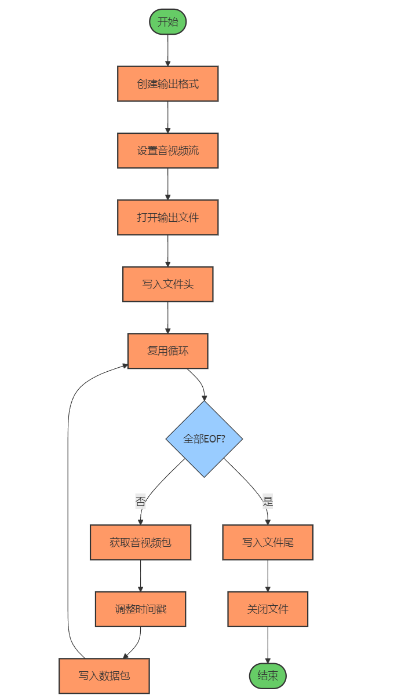

**项目整体的架构如下所示（设计思路中的括号内的标注的是实现日期）**

**更新时间:3月10日**

# 设计思路

## 整体组件介绍

该程序采用模块化设计，主要包含以下组件：

* Demux（解复用器）：负责从输入文件中分离音视频流

* VideoDecoder（视频解码器）：解码视频流为原始帧

* AudioDecoder（音频解码器）：解码音频流为PCM数据

* VideoFilter（视频滤镜）：应用各种视频处理滤镜，包括旋转、倍速等（调节PTS）

* AudioFilter（音频滤镜）：实现音频的倍速播放

* VideoEncoder（视频编码器）：将处理后的视频帧编码为压缩格式（首选mpeg4）

* AudioEncoder（音频编码器）：讲出后的音频帧编码为压缩格式（首选ac3）

* Muxer（复用器）：将编码后的音视频流合并到输出文件中

* ThreadSafeQueue（缓冲队列）：存储编码、解码数据包

* RingBuffer（环形缓冲区）：存储解析帧

线程数：

* Demux解复用线程
* VideoDecoder视频流解码线程
* AudioDecoder音频流解码线程
* VideoFilter与VideoEncoder共用一个线程作为帧处理以及编码
* Muxer复用线程
* AudioFilter与AudioEncoder共用一个线程
* Transcode主函数线程

各组件通过线程安全的队列进行数据传递，实现了高效的并行处理，整体工作流程如下所示：


* 解复用与解码端模块使用了源码中定义的**ThreadSafeQueue**类作为缓冲
* 复用与编码端模块使用了源码中定义的**ThreadSafeQueue**类作为缓冲
* 对于解码端与编码段中的链接使用了环形缓冲区，解码端将解析出来的frames存放于环形缓冲区中

## 复用中的音频同步处理

- 根据播放速度调整PTS/DTS

- 快速播放(>1.0): timestamp / playbackSpeed

- 慢速播放(<1.0): timestamp * (1.0/playbackSpeed)

- 确保与VideoFilter/AudioFilter的时间戳处理一致


## 倍速播放

### 音频倍速处理：

在 `AudioFilter` 类中，音频的播放速度调整是通过修改音频处理的滤镜链来实现的，特别是使用 `atempo` 滤镜来调整音频的播放速度。根据不同的播放速度需求，采取不同的方法：

- **对于速度大于1.0（加速）**：使用 `atempo` 滤镜，通过多个阶段来处理较高倍速（例如，对于大于2倍速的情况，使用多个 `atempo` 阶段）。
- **对于速度小于1.0（减速）**：同样使用 `atempo` 滤镜，但根据减速的倍数进行调整。对于极慢的速度，还可能加入如 `anlmdn`（音频降噪）和 `highpass`（高通滤波）等滤镜来增强音质。

### 视频倍速处理：

在 `VideoFilter` 类中，视频的播放速度调整是通过构建滤镜图来完成的：

- **对于速度大于1.0（加速）**：通过调整 `setpts`（时间戳）来加速视频播放，同时使用 `select` 滤镜来选择关键帧和非关键帧，从而保持视频的连续性。对于非常高的速度，帧的选择会更加严格，以确保视频播放流畅。
- **对于速度小于1.0（减速）**：使用类似的方式调整帧率。如果播放速度非常慢，可能会加入插帧技术来保持流畅性，这时会使用 `minterpolate` 滤镜来插入更多帧。

具体来讲以VideoFilter为例，我们有如下编码：

```c++
 speedFilter << "setpts=PTS/TB*" << (1.0 / playbackSpeed) << "*TB";
```


我们可以调整PTS，具体流程图如下所示：


## 环形缓冲区

**环形缓冲区**（Ring Buffer），适用于单生产者单消费者场景。环形缓冲区是一个循环数据结构，用于处理缓冲区大小有限但数据输入和输出速率不一致的场景。其基本特性包括：

- **环形结构**：缓冲区的末尾与开头连接，形成一个循环。写入和读取数据时，指针会不断循环，而不是每次都移动到数组的最末尾或最开头。
- **容量固定**：一旦缓冲区满，不能再插入数据，除非允许覆盖旧数据。
- **支持批量读写**：支持一次性写入和读取多个元素，提高了效率。
- **线程安全**：当前实现是线程不安全的，仅适用于单生产者单消费者场景。如果需要在多线程环境下使用，需要添加同步机制。

实现思路上，核心思路是通过维护 **头指针（head）** 和 **尾指针（tail）** 来表示缓冲区的当前读写位置，同时通过 **size** 来跟踪缓冲区中元素的数量。使用取余运算 `(index % capacity)` 来实现循环效果。


## 线程安全队列

线程安全队列是整个系统中的基础性组件，本项目使用继承该类实现的缓冲队列实现了多线程环境下的数据共享和同步问题，采用了互斥锁和条件变量实现线程同步，确保使用一致性。

在编写该模块的代码的时候需要回答以下两个问题：

使用什么数据结构实现该队列比较好？ --> 涉及到push、pop、trypop等操作，不涉及访问指定位置的数据，考虑到元素插入以及删除的便捷性使用单链表执行实现。

为什么要保证线程安全？--> 本项目目前至少存在4个线程，线程与线程之间的缓冲队列操作必须是线程安全的，可以实现系统整体的高校流水线运行效果，

整体架构如下图所示：

相关方法如下图所示：

| **方法**               | **描述**                                                     |
| ---------------------- | ------------------------------------------------------------ |
| `push(const T &value)` | 将数据压入队列，创建新节点并通过互斥锁同步，通知等待的消费者线程。 |
| `tryPop(T &value)`     | 尝试从队列中弹出数据，如果队列为空则返回 `false`，否则返回 `true`。 |
| `getSize()`            | 获取当前队列的大小。                                         |
| `isEmpty()`            | 检查队列是否为空，通过互斥锁保证线程安全。                   |
| `isEmptyUnsafe()`      | 检查队列是否为空，不进行锁定操作，仅供内部使用。             |
| `clear()`              | 清空队列，删除所有节点并释放数据。                           |

## 视频滤镜（VideoFilter）&&音频滤镜（AudioFilter）

视频滤镜为今天项目要求的实现视频旋转的关键模块，我们将在滤镜中实现视频帧的制定角度旋转的功能，便于编码，本项目将其与视频流解码模块纳入同一线程执行工作。

如何设计灵活易用的滤镜接口？--> 采用组合式设计，将复杂的FFmpeg滤镜图抽象为简单的接口。提供了高级功能（如旋转）的专用方法，同时支持通过字符串配置任意复杂的滤镜链。滤镜配置采用构建者模式，允许用户链式调用设置各种参数，提高了接口的可读性和易用性

具体的执行流程如下：


由于视频滤镜以及音频滤镜在倍速模块的处理是同步的下面以音频为例是音频过滤器处理的执行流程。


## 视频流编码器（VideoEncoder）

视频编码器将处理后的原始帧重新编码为压缩格式。它支持多种编码器，并针对不同编码器优化参数设置，确保最佳的编码质量和兼容性。

在编写该模块的代码的时候需要回答以下两个问题：

如何平衡编码质量和性能？ --> 实现了可配置的编码参数系统，允许根据需求调整比特率、GOP大小、B帧数量等参数。针对不同编码器（如H.264、MPEG-4）提供了优化的默认参数集。采用了自适应比特率控制策略，可以根据场景复杂度动态调整编码参数。同时，实现了多级编码器选择机制，可以根据系统能力自动选择最合适的编码器。

如何解决B帧导致的兼容性问题？ --> 针对MPEG-4编码器，实现了完全禁用B帧的选项，通过设置max_b_frames=0和使用AV_CODEC_FLAG_LOW_DELAY标志确保不生成B帧。在帧编码过程中，显式设置帧类型为I帧或P帧，防止编码器自动决定使用B帧。同时，实现了定期插入关键帧的机制，确保视频流的可随机访问性，提高兼容性。


## 复用器（Muxer）

复用器将编码后的音视频流合并到输出文件中。它处理容器格式、时间戳同步等问题，确保输出文件的正确性。

在编写该模块的代码的时候需要回答以下两个问题：

如何确保生成的文件格式兼容性？ --> 使用FFmpeg的容器格式抽象，支持多种输出格式（如MP4、MKV、AVI等）。针对MP4格式，特别添加了"faststart"选项，将元数据移到文件开头，提高流媒体兼容性。实现了格式自动检测机制，可以根据文件扩展名选择合适的容器格式。同时，确保正确写入全局头部信息和文件尾，防止文件损坏。

如何处理音视频同步问题？ --> 实现了基于时间戳的同步机制，通过av_rescale_q函数将不同时间基下的时间戳转换为统一标准。确保DTS（解码时间戳）不大于PTS（显示时间戳），避免播放器解析错误。在写入数据包前，会检查并修复无效的时间戳，确保时间戳单调递增。同时，实现了音视频队列平衡策略，防止某一流的数据过多导致内存占用过大。



## 解复用器（Demux）

解复用器负责从输入文件中分离音视频流，是整个处理流程的起点。它读取压缩的媒体数据，并将其分发到相应的处理队列。

在编写该模块的代码的时候需要回答以下两个问题：

如何处理不同格式的媒体文件？ --> 利用FFmpeg的AVFormatContext抽象，它能自动识别和处理各种媒体容器格式。通过avformat_open_input和avformat_find_stream_info函数，可以打开并分析任何FFmpeg支持的媒体文件，无需针对特定格式编写专门代码。

如何确保解复用过程不阻塞整个系统？ --> 将解复用过程放在独立线程中执行，通过线程安全队列将解复用后的数据包传递给后续模块。设计了非阻塞的数据读取机制，当输出队列满时可以暂停读取，避免内存溢出。同时实现了暂停/恢复功能，可以根据系统负载动态调整解复用速度。


## 视频流解码器 (VideoDecoder)&& 音频流解码器(AudioDecoder)（两者结构差不多一样）

视频解码器将压缩的视频数据转换为原始帧，为后续处理提供基础。它处理各种视频编码格式，并输出统一的未压缩帧。

在编写该模块的代码的时候需要回答以下两个问题：

如何处理不同的视频编码格式？ --> 利用FFmpeg的解码器抽象层，通过AVCodec和AVCodecContext处理各种编码格式。解码器根据输入流的编解码器参数自动配置，支持H.264、MPEG-4、VP9等各种格式，输出统一的AVFrame结构，简化了后续处理。

如何优化解码性能？ --> 实现了帧缓存复用机制，减少内存分配和释放操作。采用多线程解码策略，将解码过程与其他处理并行执行。针对关键帧和非关键帧采用不同的处理策略，提高解码效率。同时实现了直接YUV输出功能，在不需要进一步处理时可以绕过后续步骤，减少处理开销

音频流解码器的设计思路以及架构与视频流解码器几乎是一样的，这里不再赘述，具体流程如下所示。


# 遇到的问题

## 倍数与速度不匹配(待解决)

**问题描述**：当指定0.5倍播放的时候会发现音频为0.5倍但是视频流却是2倍播放，已经修正PTS放缩逻辑分支，但是使用ffplay执行测试的时候依旧发生了该问题。

以大于一倍的速度执行播放则不会出现相关类似的问题。

```c++
std::string VideoFilter::buildFilterString()
{
    if (playbackSpeed != 1.0)
    {
        
        std::ostringstream speedFilter;
        
        else if (playbackSpeed > 1.0)
        {
            speedFilter << "setpts=PTS/TB*" << (1.0 / playbackSpeed) << "*TB";
        }
        else
        {
            speedFilter << "setpts=PTS/TB/" << playbackSpeed << "*TB";
            
        }
        
        finalFilterDesc += speedFilter.str();
    }
    ....
}
```

可能解决方向：主函数中调用视频滤镜模块的setPlaybackSpeed方法的时候可能并未正确地调用buildFilterString方法，从而没有正确地使用相关滤镜来处理帧序列。

## B帧处理问题

**问题描述**：MPEG-4编码器生成警告“**too many B-frames in a row**”，导致某些播放器无法播放生成的视频文件

**解决方案**：

完全禁用B帧

```cpp
   codecContext->max_b_frames = 0;
   codecContext->b_frame_strategy = 0;
```

在编码每一帧时，明确指定帧类型为I或P帧

```
   if (frameCount % 15 == 0) {
       frame->pict_type = AV_PICTURE_TYPE_I;
       frame->key_frame = 1;
   } else {
       frame->pict_type = AV_PICTURE_TYPE_P;
   }
```

## 文件结尾处理不当

**问题描述**：转码过程中断或完成时，没用正确写入文件尾，导致输出文件损坏

**解决方案**：

确保写入文件尾

```cpp
   av_write_trailer(formatContext);
```

刷新缓冲区

```cpp
   avio_flush(formatContext->pb);
```

发送EOF标记，确保所有模块都已经知道流已结束

```cpp
   AVPacket *eofPacket = av_packet_alloc();
   eofPacket->data = nullptr;
   eofPacket->size = 0;
   eofPacket->flags = 0x100; // 自定义EOF标记
   packetQueue.push(eofPacket);
```

## 编码器初始化失败

**问题描述**：运行可执行文件显示编码器初始化失败

**解决方案**：将设定参数补全

# 项目概述：

本项目是一个基于FFmpeg的视频转码与处理工具，提供了视频解码、编码、滤镜处理和格式转换等功能。主要特点包括：

- 支持多种视频格式的解码与编码

- 提供视频旋转功能（90°、180°、270°）

- 支持视频滤镜应用

- 可以分离音视频流

- 支持直接输出解码后的原始YUV或PCM数据

- 多线程处理，提高转码效率

# 系统要求

- 操作系统：Linux

- 编译器：支持C++11标准的编译器（如GCC 4.8+、MSVC 2015+）

- 依赖库：FFmpeg（已包含在项目中）

#  编译与安装

## 使用cmake安装

```cmake
# 创建并进入构建目录
mkdir build
cd build

# 配置项目
cmake ..

# 编译项目
make

#清除项目
make clean

# 安装（可选）
make install
```

# 命令行参数

| 参数 | 长参数形式     | 描述                             | 示例               |
| ---- | -------------- | -------------------------------- | ------------------ |
| -s   | -speed         | 指定视频播放倍数                 | -s 0.5             |
| -o   | --output       | 指定输出文件                     | -o output.mp4      |
| -r   | --rotate       | 指定旋转角度（0, 90, 180, 270）  | -r 90              |
| -v   | --video-output | 指定视频直接输出文件（YUV格式）  | -v output.yuv      |
| -a   | --audio-output | 指定音频直接输出文件（PCM格式）  | -a output.pcm      |
| -f   | --filter       | 指定自定义滤镜字符串             | -f "scale=640:480" |
|      | --direct-video | 直接输出解码后的视频，不进行编码 | --direct-video     |
|      | --direct-audio | 直接输出解码后的音频，不进行编码 | --direct-audio     |
| -d   | --debug        | 启用调试模式                     | -d                 |
| -h   | --help         | 显示帮助信息                     | -h                 |

# 使用示例

## 基本转码

默认输出为mpeg4编码格式的MP4文件，示例指令如下：

```sh
./transcode input.mp4 -o output.mp4
```

## 视频旋转

```sh
./transcode input.mp4 -o rotated_output.mp4 -r 90
```

## 提取原始视频数据

```sh
./transcode input.mp4 --direct-video -v output.yuv
```

## 音频解码

```sh
./transcode input.mp4 --direct-audio -a output.pcm
```

## 应用自定义滤镜

```sh
./transcode input.mp4 -o filtered_output.mp4 -f "scale=640:480"
```

## 指定速度播放

```sh
./transcode input.mp4 -s 0.5
```

# 编码器编码格式设定

## 视频编码

程序会尝试使用以下编码器（按优先级排序）：

* MPEG-4 (mpeg4)

* MPEG-1 (mpeg1video)

* Motion JPEG (mjpeg)

* H.264 (libx264)

* H.264 (h264)

* 原始视频 (rawvideo)

如果前面的编码器初始化失败，程序会自动尝试下一个编码器。

## 音频编码

使用ac3格式进行编码

# 性能优化

1. 多线程处理：解码、滤镜处理和编码在不同线程中并行执行

1. 线程安全队列：使用线程安全队列在各组件间传递数据

1. 编码器参数优化：针对不同编码器设置了优化的参数


# 常见问题

## 编码器初始化失败

如果特定编码器初始化失败，程序会自动尝试其他编码器。如果所有编码器都失败，请检查：

- 输入视频的格式和分辨率是否受支持

- 系统是否安装了必要的编解码器

## 内存使用过高

对于高分辨率视频，程序可能使用较多内存。可以通过以下方式减少内存使用：

- 使用较小的队列大小

- 处理前将视频缩放到较小的分辨率